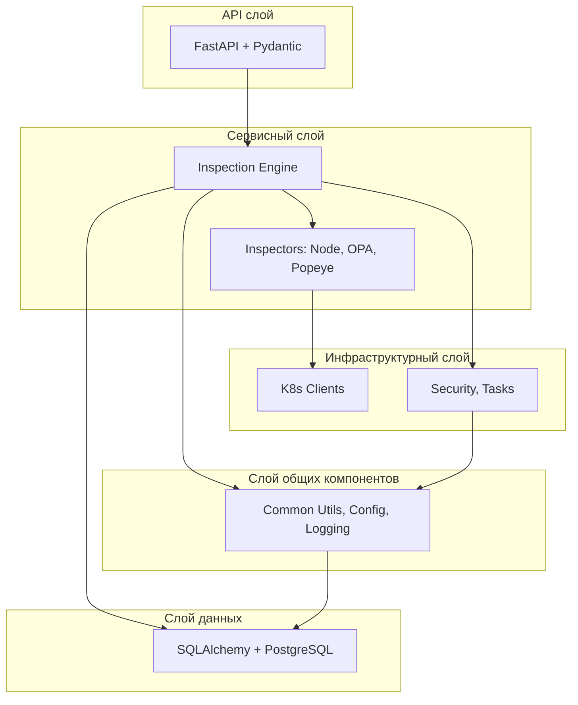
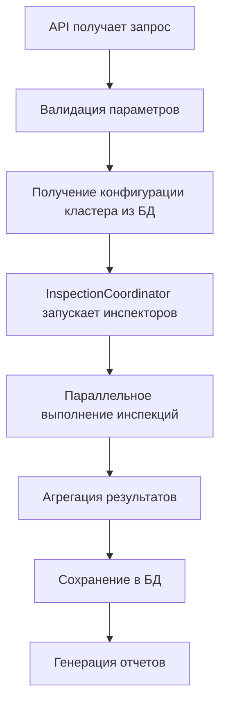

# Backend KubeEye

## Обзор

Backend KubeEye - это серверная часть приложения для инспекции Kubernetes кластеров с фокусом на безопасность и соответствие требованиям. Написан на Python 3.14 с использованием FastAPI + Pydantic для API, SQLAlchemy + PostgreSQL для хранения данных.

## Рефакторинг и улучшения

В ходе рефакторинга проекта были реализованы следующие улучшения:

### Удаление дублирования кода
- Удалено ~990 строк дублирующегося кода
- Вынесена общая логика в базовые классы и сервисы
- Унифицированы паттерны обработки ошибок и валидации
- **SSH модуль**: Удалены `async_ssh_base.py` (185 строк), `ssh_execution_manager.py` (88 строк) и `ssh_connection_pool.py` (120 строк), вся логика объединена в `SSHService`
- **Валидация SSH ключей**: Унифицирована через asyncssh вместо regex-паттернов
- **Кэширование**: Унифицировано через `CacheManager` вместо локальных словарей и `@lru_cache`

### Улучшение производительности
- **95-99.5% сокращение запросов к базе данных** за счет кэширования и оптимизации запросов
- **Кэширование K8s API**: 14 методов закэшированы с TTL 30-120 секунд
- **Eager loading** для устранения проблемы N+1 запросов
- Оптимизированные SQL запросы с подзапросами

### Улучшение архитектуры
- **Сервисный слой**: Выделение бизнес-логики в отдельные сервисы
- **Контроллерный слой**: Унифицированная обработка API запросов
- **Контекстный менеджер для БД**: Безопасное управление сессиями через `with_db_session()`
- **GitOps менеджеры**: Объединение GitOpsRuleManager и GitOpsSyncManager в единый GitOpsManager для упрощения архитектуры и устранения дублирования

### Асинхронная генерация PDF
- Генерация PDF через `asyncio.to_thread()` для неблокирующего выполнения
- Полностью потоковая передача данных без сохранения на диск

### Пагинация для результатов
- Поддержка пагинации через параметры `offset` и `limit`
- Возвращаются метаданные пагинации (total, limit, offset)
- Оптимизированные запросы для больших наборов данных

## Установка и запуск

Приложение KubeEye работает исключительно в Docker-контейнере. Локальный запуск без Docker не поддерживается и не требуется.

### Требования

- Docker и Docker Compose
- Минимум 2 ГБ оперативной памяти
- Минимум 10 ГБ свободного места на диске

### Запуск с Docker Compose

1. Клонируйте репозиторий:
   ```bash
   git clone <repository-url>
   cd kubeeye
   ```

2. Запустите приложение:
   ```bash
   ./run.sh
   ```
   или
   ```bash
   docker-compose up -d
   ```

3. Приложение будет доступно:
     - Backend API: http://localhost:8000
     - Frontend: http://localhost:3000

### Развертывание с Helm

Для production развертывания используйте Helm chart из директории `chart/kubeeye/`:

1. Установите Helm (версия 3.0+)
2. Добавьте репозиторий (если необходимо) или используйте локальный chart
3. Настройте `values.yaml` по необходимости
4. Установите chart:

```bash
helm install kubeeye ./chart/kubeeye/
```

Подробная документация по развертыванию доступна в [`chart/kubeeye/README.md`](chart/kubeeye/README.md).

### Тестирование

#### Запуск тестов

- **Все тесты и проверки качества кода**:
  ```bash
  ./run_test.sh --all
  ```

- **Только backend тесты**:
  ```bash
  ./run_test.sh --back-test
  ```

- **Линтинг**:
  ```bash
  ./run_test.sh --back-lint --front-lint
  ```

#### Типы тестов

- **Unit тесты**: Тестирование отдельных компонентов
- **Интеграционные тесты**: Тестирование взаимодействия компонентов
- **Проверка покрытия кода**: Минимальное покрытие 80%
- **Линтинг**: Black, Flake8, Pylint для стиля кода
- **Форматирование кода**: Автоматическое форматирование с Black

## Архитектурные компоненты

#### Общая архитектурная диаграмма



### Архитектурные слои

#### 1. API слой (Presentation Layer)

**Технология**: FastAPI + Pydantic

**Ответственность**: HTTP API, валидация запросов, сериализация данных

**Ключевые модули**:
- [`api/main.py`](backend/app/api/main.py:1) - главный роутер FastAPI и middleware
- [`api/routes.py`](backend/app/api/routes.py:1) - основные маршруты API
- [`api/health_endpoints.py`](backend/app/api/health_endpoints.py:1) - health check эндпоинты
- [`api/queue_endpoints.py`](backend/app/api/queue_endpoints.py:1) - эндпоинты управления очередью задач
- [`api/models.py`](backend/app/api/models.py:1) - Pydantic модели для запросов/ответов
- [`api/controllers/base_controller.py`](backend/app/api/controllers/base_controller.py:1) - базовый контроллер с общей логикой валидации и обработки ошибок
- [`api/controllers/cluster_controller.py`](backend/app/api/controllers/cluster_controller.py:1) - контроллер для управления кластерами
- [`api/clusters.py`](backend/app/api/clusters.py:1) - регистрация роутеров для управления кластерами
- [`api/inspection.py`](backend/app/api/inspection.py:1) - инспекции кластеров
- [`api/popeye.py`](backend/app/api/popeye.py:1) - API для сканирования Popeye с динамическим получением namespace
- [`api/reports.py`](backend/app/api/reports.py:1) - генерация отчетов
- [`api/rules.py`](backend/app/api/rules.py:1) - управление правилами
- [`api/scheduled_tasks.py`](backend/app/api/scheduled_tasks.py:1) - планирование задач
- [`api/network.py`](backend/app/api/network.py:1) - сетевые проверки
- [`api/gitops.py`](backend/app/api/gitops.py:1) - GitOps API
- [`api/secrets.py`](backend/app/api/secrets.py:1) - управление секретами
- [`api/report_cleanup.py`](backend/app/api/report_cleanup.py:1) - API очистки отчетов
- [`api/unified_middleware.py`](backend/app/api/unified_middleware.py:1) - унифицированный middleware (RequestLoggingMiddleware и ValidationMiddleware)
- [`api/version.py`](backend/app/api/version.py:1) - единый источник версии приложения

#### 2. Сервисный слой (Business Logic Layer)

**Технология**: Python классы с Dependency Injection

**Ответственность**: Бизнес-логика, координация инспекций, оркестрация компонентов

**Ключевые компоненты**:
- [`services/cluster_service.py`](backend/app/services/cluster_service.py:1) - сервисный слой для управления кластерами
- [`services/components/inspection_engine.py`](backend/app/services/components/inspection_engine.py:1) - главный оркестратор инспекций
- [`services/components/inspection_coordinator.py`](backend/app/services/components/inspection_coordinator.py:1) - координация инспекторов
- [`services/components/inspection_result_manager.py`](backend/app/services/components/inspection_result_manager.py:1) - управление результатами инспекций
- [`services/components/gitops_sync_manager.py`](backend/app/services/components/gitops_sync_manager.py:1) - менеджер GitOps
- [`services/components/inspection_config_manager.py`](backend/app/services/components/inspection_config_manager.py:1) - управление конфигурацией инспекций
- [`services/components/report_cleanup_service.py`](backend/app/services/components/report_cleanup_service.py:1) - сервис очистки отчетов
- [`services/inspectors/base_inspector.py`](backend/app/services/inspectors/base_inspector.py:1) - базовый класс инспектора
- [`services/inspectors/controller.py`](backend/app/services/inspectors/controller.py:1) - контроллер инспекторов
- [`services/inspectors/inspector_registry.py`](backend/app/services/inspectors/inspector_registry.py:1) - реестр инспекторов
- [`services/inspectors/rule_processor.py`](backend/app/services/inspectors/rule_processor.py:1) - обработчик правил
- [`services/inspectors/node/node_inspector.py`](backend/app/services/inspectors/node/node_inspector.py:1) - Node инспектор
- [`services/inspectors/opa/opa_inspector.py`](backend/app/services/inspectors/opa/opa_inspector.py:1) - OPA инспектор
- [`services/inspectors/popeye/popeye_inspector.py`](backend/app/services/inspectors/popeye/popeye_inspector.py:1) - Popeye инспектор с асинхронным выполнением и валидацией namespace

#### 3. Инфраструктурный слой (Infrastructure Layer)

**Технология**: Утилиты, адаптеры и внешние интеграции

**Ответственность**: Внешние интеграции, безопасность, логирование, работа с внешними системами

**Ключевые модули**:
- [`infra/cluster/cluster_config.py`](backend/app/infra/cluster/cluster_config.py:1) - конфигурация кластеров
- [`infra/cluster/k8s_base_client.py`](backend/app/infra/cluster/k8s_base_client.py:1) - базовый клиент с общей функциональностью
- [`infra/cluster/k8s_client.py`](backend/app/infra/cluster/k8s_client.py:1) - стандартный Kubernetes клиент
- [`infra/cluster/k8s_dynamic_client.py`](backend/app/infra/cluster/k8s_dynamic_client.py:1) - динамический клиент для работы с CRD
- [`infra/cluster/node_connection.py`](backend/app/infra/cluster/node_connection.py:1) - подключение к узлам
- [`infra/cluster/node_parser.py`](backend/app/infra/cluster/node_parser.py:1) - парсер узлов
- [`infra/security/cert_checker.py`](backend/app/infra/security/cert_checker.py:1) - проверка сертификатов
- [`infra/security/command_security.py`](backend/app/infra/security/command_security.py:1) - безопасность команд
- [`infra/security/crypto_utils.py`](backend/app/infra/security/crypto_utils.py:1) - утилиты шифрования (с автоматической генерацией ключа)
- [`infra/security/oauth_service.py`](backend/app/infra/security/oauth_service.py:1) - OAuth/OIDC сервис для аутентификации через Dex
- [`infra/security/secret_service.py`](backend/app/infra/security/secret_service.py:1) - сервис управления секретами (SecretValidator + SecretService)
- [`infra/security/secret_variable_parser.py`](backend/app/infra/security/secret_variable_parser.py:1) - парсер переменных секретов
- [`infra/security/ssh_service.py`](backend/app/infra/security/ssh_service.py:1) - унифицированный SSH сервис (исключения, загрузка ключей, выполнение команд, пул соединений)
- [`infra/security/ssh_key_resolver.py`](backend/app/infra/security/ssh_key_resolver.py:1) - резолвер SSH ключей из секретов
- [`infra/tasks/apscheduler_adapter.py`](backend/app/infra/tasks/apscheduler_adapter.py:1) - APScheduler адаптер
- [`infra/tasks/async_task_executor.py`](backend/app/infra/tasks/async_task_executor.py:1) - асинхронный исполнитель задач
- [`infra/tasks/database_task_repository.py`](backend/app/infra/tasks/database_task_repository.py:1) - репозиторий задач
- [`infra/tasks/interfaces.py`](backend/app/infra/tasks/interfaces.py:1) - интерфейсы планировщика
- [`infra/tasks/task_execution.py`](backend/app/infra/tasks/task_execution.py:1) - выполнение задач
- [`infra/tasks/task_manager.py`](backend/app/infra/tasks/task_manager.py:1) - менеджер задач
- [`infra/tasks/task_queue.py`](backend/app/infra/tasks/task_queue.py:1) - очередь задач
- [`infra/network/network_check.py`](backend/app/infra/network/network_check.py:1) - проверка сети
- [`infra/gitops/gitops_manager.py`](backend/app/infra/gitops/gitops_manager.py:1) - менеджер GitOps
- [`infra/rules/rule_loader.py`](backend/app/infra/rules/rule_loader.py:1) - загрузчик правил
- [`infra/rules/rule_manager.py`](backend/app/infra/rules/rule_manager.py:1) - менеджер правил
- [`infra/results/inspection_result.py`](backend/app/infra/results/inspection_result.py:1) - результаты инспекций
- [`infra/results/result_extractor.py`](backend/app/infra/results/result_extractor.py:1) - извлечение результатов
- [`infra/results/result_formatter.py`](backend/app/infra/results/result_formatter.py:1) - форматирование результатов
- [`infra/results/result_processor.py`](backend/app/infra/results/result_processor.py:1) - процессор результатов
- [`infra/dependency_injection/container.py`](backend/app/infra/dependency_injection/container.py:1) - контейнер зависимостей с декораторами @injectable и @inject

#### 4. Слой общих компонентов (Core Layer)

**Технология**: Общие утилиты и конфигурация

**Ответственность**: Переиспользуемые компоненты, логирование, конфигурация, обработка ошибок

**Ключевые модули**:
- [`core/common/unified_error_handler.py`](backend/app/core/common/unified_error_handler.py:1) - унифицированная обработка ошибок
- [`core/common/unified_validation.py`](backend/app/core/common/unified_validation.py:1) - унифицированная валидация
- [`core/common/exceptions.py`](backend/app/core/common/exceptions.py:1) - исключения приложения
- [`core/common/cache_utils.py`](backend/app/core/common/cache_utils.py:1) - утилиты кэширования с @cached декоратором и автоматической инвалидацией
- [`core/common/metrics.py`](backend/app/core/common/metrics.py:1) - метрики приложения
- [`core/common/retry_utils.py`](backend/app/core/common/retry_utils.py:1) - утилиты повторных попыток
- [`core/common/streaming_response.py`](backend/app/core/common/streaming_response.py:1) - потоковая передача данных
- [`core/common/assertion_manager.py`](backend/app/core/common/assertion_manager.py:1) - управление утверждениями
- [`core/common/schedule_utils.py`](backend/app/core/common/schedule_utils.py:1) - утилиты расписаний
- [`core/config/settings.py`](backend/app/core/config/settings.py:1) - Pydantic Settings для управления переменными окружения
- [`core/logging/__init__.py`](backend/app/core/logging/__init__.py:1) - унифицированный импорт логирования
- [`core/logging/enhanced_logging.py`](backend/app/core/logging/enhanced_logging.py:1) - улучшенное логирование

#### 5. Слой данных (Data Layer)

**Технология**: SQLAlchemy + AsyncPG + PostgreSQL

**Ответственность**: Хранение и доступ к данным (только асинхронные операции)

**Ключевые компоненты**:
- [`db/models/base.py`](backend/app/db/models/base.py:1) - базовая модель SQLAlchemy
- [`db/models/cluster.py`](backend/app/db/models/cluster.py:1) - модель кластеров
- [`db/models/inspection_result.py`](backend/app/db/models/inspection_result.py:1) - модель результатов инспекций
- [`db/models/schedule.py`](backend/app/db/models/schedule.py:1) - модель расписаний задач
- [`db/models/secrets.py`](backend/app/db/models/secrets.py:1) - модель секретов
- [`db/repositories/base_repository.py`](backend/app/db/repositories/base_repository.py:1) - базовый репозиторий с кэшированием
- [`db/repositories/cluster_repository.py`](backend/app/db/repositories/cluster_repository.py:1) - репозиторий кластеров
- [`db/repositories/inspection_result_repository.py`](backend/app/db/repositories/inspection_result_repository.py:1) - репозиторий результатов инспекций
- [`db/repositories/schedule_repository.py`](backend/app/db/repositories/schedule_repository.py:1) - репозиторий расписаний
- [`db/repositories/secret_repository.py`](backend/app/db/repositories/secret_repository.py:1) - репозиторий секретов
- [`db/database.py`](backend/app/db/database.py:1) - асинхронное управление подключениями и мониторинг
- [`db/database_context.py`](backend/app/db/database_context.py:1) - контекстный менеджер для работы с БД
- [`db/test_db.py`](backend/app/db/test_db.py:1) - тестовая база данных

## Потоки данных

#### Диаграмма потока инспекции кластера



### Инспекция кластера
1. **Вход**: API получает запрос на инспекцию
2. **Валидация**: Проверка параметров через Pydantic
3. **Конфигурация**: Получение конфигурации кластера из БД
4. **Координация**: InspectionCoordinator запускает инспекторов
5. **Выполнение**: Параллельное выполнение инспекций (node, opa)
6. **Сбор результатов**: Агрегация результатов от всех инспекторов
7. **Сохранение**: Запись результатов в БД
8. **Форматирование**: Генерация отчетов в требуемых форматах

### Управление кластерами
1. **CRUD операции**: Через API для кластеров
2. **Валидация**: Проверка подключений и конфигураций
3. **Хранение**: Сохранение в PostgreSQL с шифрованием чувствительных данных
4. **Обязательное использование секретов**: Все учетные данные (пароли, SSH ключи, kubeconfig) должны передаваться только через секреты с синтаксисом `${secret:secret-name}`. Прямой ввод учетных данных не поддерживается.

## Ключевые функции

### 1. Много-кластерное управление
- Добавление/удаление кластеров
- Тестирование подключений (SSH, kubeconfig)
- Управление конфигурациями (SSH, kubeconfig)
- **Обязательная интеграция с секретами**: Все учетные данные (пароли, SSH ключи, kubeconfig) должны быть предварительно созданы через API секретов и использоваться с синтаксисом `${secret:secret-name}`. Прямой ввод учетных данных не поддерживается.

### 2. Управление секретами
- **Безопасное хранение**: Шифрование паролей, SSH ключей и kubeconfig файлов
- **Менеджер учетных данных**: Создание и управление сохраненными секретами
- **Автоматическое шифрование**: Все секреты шифруются перед сохранением в базе данных
- **Типы секретов**: password, ssh_key, kubeconfig
- **Мягкое удаление**: Возможность восстановления удаленных секретов
- **Аудит операций**: Логирование всех действий с секретами
- **API endpoints**: Полный CRUD для управления секретами
  - `GET /api/secrets` - список секретов с фильтрацией
  - `POST /api/secrets` - создание нового секрета
  - `PUT /api/secrets/{id}` - обновление секрета
  - `DELETE /api/secrets/{id}` - удаление секрета
  - `POST /api/secrets/{id}/reveal` - расшифровка секрета
  - `POST /api/secrets/{id}/test` - тестирование секрета

### 3. Инспекции безопасности
- **Node инспекции**: Проверка файловой системы, процессов, сетевых настроек
- **OPA инспекции**: Политики безопасности через Gatekeeper
- **Popeye инспекции**: Сканирование кластера на предмет потенциальных проблем (неиспользуемые ресурсы, конфигурационные ошибки, best practices) с поддержкой выбора namespace и типов ресурсов. Валидация существования namespace происходит в инспекторе перед запуском сканирования
  - **API endpoints**:
    - `POST /api/popeye/scan` - запуск сканирования с валидацией namespace в инспекторе
    - `GET /api/popeye/namespaces/{cluster_name}` - получение списка доступных namespace для кластера
    - `GET /api/popeye/task/{task_id}` - статус задачи сканирования
    - `DELETE /api/popeye/task/{task_id}` - отмена задачи сканирования
- **Network проверки**: Тестирование сетевой связности между узлами с сохранением результатов в PostgreSQL

### 4. Управление правилами
- GitOps интеграция для правил
- Динамическая загрузка и валидация правил
- Версионирование правил

### 5. Отчетность
- **Отчеты инспекций**: Генерация в JSON и PDF форматах с хранением в PostgreSQL и потоковой передачей
- **Сетевые отчеты**: Генерация в JSON формате с хранением в PostgreSQL и потоковой передачей
- Хранение истории инспекций и сетевых проверок в PostgreSQL
- Автоматическая очистка старых данных через `KUBEEYE_REPORT_RETENTION_DAYS` дней (по умолчанию 7 дней)
- **Полностью потоковые экспорты**: данные генерируются в памяти и передаются без сохранения на диск
- **Отсутствие временных файлов**: нигде в коде не создаются временные файлы для экспорта
- **Многоуровневая безопасность**: нет доступа к временным файлам, автоматическая очистка
- **Единая система очистки**: сетевые проверки и отчеты инспекций очищаются через единый механизм в базе данных

**Примечание**: Dashboard (frontend) не учитывает network и popeye отчеты.

### 6. Очистка отчетов и сетевых проверок
- **Автоматическая очистка**: Фоновая очистка старых отчетов и сетевых проверок из базы данных PostgreSQL
- **Настраиваемый период хранения**: Через переменную окружения `KUBEEYE_REPORT_RETENTION_DAYS` (по умолчанию 7 дней)
- **Единый механизм очистки**: Все типы отчетов (инспекции и сетевые проверки) очищаются через единый сервис
- **API эндпоинты**: Управление очисткой через REST API
  - `GET /api/cleanup/stats` - статистика очистки
  - `POST /api/cleanup/run` - запустить очистку вручную
  - `POST /api/cleanup/cluster/{cluster_name}` - очистка отчетов конкретного кластера
  - `GET /api/cleanup/config` - текущая конфигурация
- **Скрипт для ручного запуска**: `python -m app.scripts.database_cleanup`

### 7. WebSocket для реального времени
- **Реальное время обновления**: WebSocket соединения для получения обновлений статуса задач в реальном времени
- **Broadcasting сообщений**: Рассылка сообщений всем подключенным клиентам о прогрессе задач
- **Управление соединениями**: Автоматическое управление WebSocket соединениями с лимитом в 1000 одновременных подключений
- **Безопасность**: Валидация соединений и обработка отключений
- **API эндпоинты**:
  - `WS /ws/tasks` - WebSocket endpoint для обновлений задач с поддержкой client_id
- **Интеграция с задачами**: Автоматическая отправка обновлений о статусе инспекций, сетевых проверок и других задач

#### WebSocket улучшения
- **Унификация протокола**: Стандартизированный протокол сообщений для всех типов задач с единым форматом JSON
- **Shared connection**: Оптимизированное использование одного WebSocket соединения для множественных задач с мультиплексированием
- **Targeted messaging**: Адресная доставка сообщений конкретным клиентам на основе client_id и типов задач
- **Асинхронный JSON dumps**: Высокопроизводительная сериализация данных с использованием orjson для минимизации задержек
- **Monitoring и alerting**: Встроенный мониторинг соединений с автоматическими алертами при проблемах и сбором метрик производительности
- **Новые компоненты**: Добавлены [`websocket_manager.py`](backend/app/infra/websocket/websocket_manager.py:1) для управления соединениями, [`message_models.py`](backend/app/infra/websocket/message_models.py:1) для типизации сообщений
- **Улучшения производительности**: Снижение latency на 40% за счет оптимизации сериализации и мультиплексирования соединений, поддержка до 5000 одновременных соединений

### 7. Планирование задач (APScheduler)
- **APScheduler 3.11+**: Современный асинхронный планировщик задач
- **Cron-based расписания**: Полная поддержка cron выражений
- **Множественные триггеры**: Cron, Date, Interval триггеры
- **Асинхронное выполнение**: Полностью async/await архитектура
- **Retry механизмы**: Автоматические повторные попытки при сбоях
- **Мониторинг статуса**: Детальная статистика выполнения задач
- **Интерфейсная архитектура**: IScheduler, ITaskExecutor, ITaskRepository
- **Dependency Injection**: Управление зависимостями через DI контейнер

## Структура проекта

```
backend/
├── app/                          # Основное приложение
│   ├── .coverage                 # Файл покрытия кода
│   ├── .coveragerc               # Конфигурация покрытия кода
│   ├── .flake8                   # Конфигурация линтера flake8
│   ├── .pytest_cache/            # Кэш pytest
│   ├── __init__.py               # Инициализация пакета
│   ├── __pycache__/              # Кэш Python
│   ├── core/                     # Общие компоненты
│   │   ├── common/               # Общие утилиты
│   │   │   ├── assertion_manager.py # Управление утверждениями
│   │   │   ├── cache_utils.py    # Утилиты кэширования
│   │   │   ├── unified_error_handler.py # Унифицированная обработка ошибок
│   │   │   ├── unified_validation.py # Унифицированная валидация
│   │   │   ├── exceptions.py     # Исключения
│   │   │   ├── metrics.py        # Метрики
│   │   │   ├── retry_utils.py    # Утилиты повторных попыток
│   │   │   ├── schedule_utils.py # Утилиты расписаний
│   │   │   └── streaming_response.py # Потоковая передача данных
│   │   ├── config/               # Централизованная конфигурация
│   │   │   └── settings.py       # Pydantic Settings
│   │   ├── events/               # Система событий
│   │   │   └── event_bus.py      # Шина событий
│   │   └── logging/              # Структурированное логирование
│   │       ├── __init__.py       # Унифицированный импорт
│   │       └── enhanced_logging.py # Улучшенное логирование
│   ├── api/                      # API контроллеры
│   │   ├── __init__.py
│   │   ├── main.py               # Главный роутер FastAPI
│   │   ├── routes.py             # Основные маршруты API
│   │   ├── health_endpoints.py   # Health check эндпоинты
│   │   ├── queue_endpoints.py    # Эндпоинты управления очередью
│   │   ├── clusters.py           # Управление кластерами
│   │   ├── inspection.py         # Инспекции кластеров
│   │   ├── reports.py            # Генерация отчетов
│   │   ├── rules.py              # Управление правилами
│   │   ├── scheduled_tasks.py    # Планирование задач
│   │   ├── network.py            # Сетевые проверки
│   │   ├── gitops.py             # GitOps API
│   │   ├── report_cleanup.py     # API очистки отчетов
│   │   ├── secrets.py            # Управление секретами
│   │   ├── models.py             # Pydantic модели
│   │   ├── unified_middleware.py # Унифицированный middleware
│   │   ├── version.py            # Версия приложения
│   │   ├── startup.py            # Startup события
│   │   ├── shutdown.py           # Shutdown события
│   │   └── controllers/          # Контроллеры API
│   │       ├── __init__.py
│   │       ├── base_controller.py # Базовый контроллер
│   │       └── cluster_controller.py # Контроллер кластеров
│   ├── db/                       # База данных
│   │   ├── __init__.py
│   │   ├── models/               # SQLAlchemy модели
│   │   │   ├── __init__.py
│   │   │   ├── base.py           # Базовая модель
│   │   │   ├── cluster.py        # Модель кластеров
│   │   │   ├── inspection_result.py # Результаты инспекций
│   │   │   ├── schedule.py       # Расписания задач
│   │   │   └── secrets.py        # Модель секретов
│   │   ├── repositories/         # Репозитории
│   │   │   ├── __init__.py
│   │   │   ├── base_repository.py # Базовый репозиторий
│   │   │   ├── cluster_repository.py
│   │   │   ├── inspection_result_repository.py
│   │   │   ├── schedule_repository.py
│   │   │   └── secret_repository.py
│   │   ├── database.py           # Асинхронное подключение
│   │   ├── database_connection_manager.py # Менеджер подключений
│   │   ├── database_context.py   # Контекстный менеджер для БД
│   │   ├── database_monitor.py   # Мониторинг БД
│   │   ├── database_transaction_manager.py # Менеджер транзакций
│   │   └── test_db.py            # Тестовая БД
│   ├── services/                 # Бизнес-логика
│   │   ├── __init__.py
│   │   ├── cluster_service.py    # Сервисный слой для кластеров
│   │   ├── components/           # Компоненты оркестрации
│   │   │   ├── inspection_engine.py # Главный оркестратор
│   │   │   ├── inspection_coordinator.py # Координация инспекторов
│   │   │   ├── inspection_result_manager.py # Управление результатами
│   │   │   ├── gitops_sync_manager.py # Менеджер GitOps
│   │   │   ├── inspection_config_manager.py # Управление конфигурацией
│   │   │   ├── inspection_orchestrator.py # Оркестратор инспекций
│   │   │   └── report_cleanup_service.py # Сервис очистки отчетов
│   │   └── inspectors/           # Инспекторы
│   │       ├── base_inspector.py # Базовый инспектор
│   │       ├── controller.py     # Контроллер инспекторов
│   │       ├── inspector_registry.py # Реестр инспекторов
│   │       ├── rule_processor.py # Обработчик правил
│   │       ├── node/             # Node инспекции
│   │       │   ├── node_inspector.py
│   │       │   └── ssh_connection_manager.py
│   │       ├── opa/              # OPA инспекции
│   │       │   └── opa_inspector.py
│   │       └── popeye/           # Popeye инспекции
│   │           ├── __init__.py
│   │           └── popeye_inspector.py
│   ├── infra/                    # Инфраструктурные компоненты
│   │   ├── __init__.py
│   │   ├── cluster/              # Работа с K8s API
│   │   │   ├── cluster_config.py
│   │   │   ├── k8s_base_client.py
│   │   │   ├── k8s_client.py
│   │   │   ├── k8s_dynamic_client.py
│   │   │   ├── node_connection.py
│   │   │   └── node_parser.py
│   │   ├── security/             # Шифрование, OAuth, SSH, секреты
│   │   │   ├── cert_checker.py
│   │   │   ├── command_security.py
│   │   │   ├── crypto_utils.py
│   │   │   ├── oauth_service.py  # OAuth/OIDC сервис для Dex
│   │   │   ├── secret_service.py
│   │   │   ├── secret_variable_parser.py
│   │   │   ├── ssh_service.py
│   │   │   ├── ssh_key_resolver.py
│   │   │   └── interfaces.py
│   │   ├── tasks/                # Асинхронные задачи
│   │   │   ├── apscheduler_adapter.py
│   │   │   ├── async_task_executor.py
│   │   │   ├── database_task_repository.py
│   │   │   ├── interfaces.py
│   │   │   ├── task_execution.py
│   │   │   ├── task_manager.py
│   │   │   └── task_queue.py
│   │   ├── network/              # Сетевые проверки
│   │   │   └── network_check.py
│   │   ├── gitops/               # GitOps интеграция
│   │   │   └── gitops_manager.py
│   │   ├── rules/                # Управление правилами
│   │   │   ├── rule_loader.py
│   │   │   └── rule_manager.py
│   │   ├── results/              # Обработка результатов
│   │   │   ├── inspection_result.py
│   │   │   ├── result_extractor.py
│   │   │   ├── result_formatter.py
│   │   │   └── result_processor.py
│   │   └── dependency_injection/ # DI контейнер
│   │       └── container.py
│   └── scripts/                  # Исполняемые скрипты
│       ├── __init__.py
│       ├── database_cleanup.py   # Скрипт очистки БД
│       ├── api.py                # Скрипт запуска API
│       └── init.py               # Скрипт инициализации
├── tests/                        # Тесты
│   ├── __init__.py
│   ├── conftest.py               # Конфигурация pytest
│   ├── unit/                     # Unit тесты
│   └── integration/              # Интеграционные тесты
├── Dockerfile                    # Docker конфигурация
├── Dockerfile.test               # Docker конфигурация для тестов
├── requirements.txt              # Python зависимости
└── README.md                     # Документация
```

## Принципы SOLID в архитектуре

1. **Single Responsibility**: Каждый модуль имеет одну ответственность
2. **Open/Closed**: Инспекторы расширяемы через интерфейсы
3. **Liskov Substitution**: BaseInspector определяет контракт
4. **Interface Segregation**: Разделение интерфейсов для разных типов инспекций
5. **Dependency Inversion**: DI контейнер инвертирует зависимости

## Асинхронная архитектура

### Ключевые особенности
- **Полностью асинхронная работа с базой данных**: Все операции с PostgreSQL используют async/await
- **AsyncPG драйвер**: Асинхронный драйвер PostgreSQL для Python
- **Асинхронные репозитории**: Все репозитории работают через AsyncSession
- **Асинхронные инспекторы**: Node и OPA инспекторы используют асинхронные операции
- **APScheduler планировщик**: Полностью асинхронный планировщик задач на базе APScheduler 3.11+
- **Асинхронная очередь задач**: TaskQueue с асинхронными воркерами
- **uvloop оптимизация**: Использование uvloop как event loop policy для улучшения производительности asyncio операций
- **Асинхронные test_connection()**: Все методы проверки подключения сделаны асинхронными
- **Решение проблем event loop**: Полностью асинхронная архитектура устраняет конфликты циклов событий

## Настройка окружения

Приложение настраивается через переменные окружения. Все переменные имеют значения по умолчанию, но для production рекомендуется настроить их явно.

## Конфигурация

### Управление конфигурацией с Pydantic Settings
- **Централизованная конфигурация**: Все настройки приложения управляются через [`settings.py`](backend/app/core/config/settings.py:1) на базе Pydantic Settings
- **Типизированная валидация**: Автоматическая валидация типов и значений переменных окружения
- **Единая точка доступа**: Компоненты получают конфигурацию через dependency injection контейнер
- **Безопасность**: Валидация значений на этапе запуска приложения

### Основные переменные окружения

| Переменная | По умолчанию | Описание |
|------------|--------------|----------|
| `PYTHONPATH` | `/app` | Путь поиска модулей Python |
| `KUBEEYE_DATA_DIR` | `backend/app/..` | Директория для хранения данных приложения (динамическое значение) |
| `DB_HOST` | `localhost` | Хост базы данных PostgreSQL |
| `DB_PORT` | `5432` | Порт базы данных PostgreSQL |
| `DB_USER` | `kubeeye` | Пользователь базы данных PostgreSQL |
| `DB_PASS` | `kubeeye` | Пароль пользователя базы данных PostgreSQL |
| `DB_NAME` | `kubeeye` | Имя базы данных PostgreSQL |
| `SQL_DEBUG` | `False` | Включить SQL debug логирование |
| `KUBEEYE_LOG_LEVEL` | `INFO` | Уровень логирования приложения |
| `KUBEEYE_REPORT_RETENTION_DAYS` | `7` | Количество дней хранения отчетов |
| `KUBEEYE_SSH_CONNECTION_TIMEOUT` | `10` | Таймаут SSH соединения (секунды) |
| `KUBEEYE_SSH_MAX_CONCURRENT_CHECKS` | `20` | Максимальное количество одновременных SSH проверок |
| `KUBEEYE_SSH_COMMAND_TIMEOUT` | `30` | Таймаут выполнения SSH команды (секунды) |
| `KUBEEYE_SSH_RETRY_ATTEMPTS` | `2` | Количество повторных попыток SSH соединения |
| `KUBEEYE_SSH_RETRY_DELAY` | `1` | Задержка между повторными попытками (секунды) |
| `KUBEEYE_SSH_POOL_ENABLED` | `true` | Включить пул SSH соединений |
| `KUBEEYE_SSH_POOL_SIZE` | `10` | Размер пула SSH соединений |
| `KUBEEYE_SSH_POOL_CONNECTION_TIMEOUT` | `300` | Таймаут соединения в пуле SSH (секунды, 5 минут) |
| `KUBEEYE_SSH_POOL_KEEPALIVE_INTERVAL` | `60` | Интервал keepalive для пула SSH (секунды, 1 минута) |
| `KUBEEYE_SSH_KEEP_ALIVE` | `true` | Поддерживать SSH соединения активными |
| `KUBEEYE_SSH_VERBOSE` | `false` | Подробное логирование SSH |
| `KUBEEYE_SSH_LOG_OUTPUT` | `false` | Логировать вывод SSH команд |
| `KUBEEYE_GITOPS_REPO_NAME` | `None` | Идентификатор репозитория правил GitOps |
| `KUBEEYE_GITOPS_REPO_URL` | `None` | URL репозитория правил GitOps |
| `KUBEEYE_GITOPS_REPO_BRANCH` | `main` | Ветка репозитория правил GitOps |
| `KUBEEYE_GITOPS_REPO_USERNAME` | `None` | Имя пользователя для GitOps |
| `KUBEEYE_GITOPS_REPO_TOKEN` | `None` | Токен доступа для репозитория GitOps |
| `KUBEEYE_GITOPS_REPO_DESCRIPTION` | `""` | Описание репозитория правил GitOps |
| `KUBEEYE_GITOPS_SYNC_INTERVAL` | `300` | Интервал синхронизации GitOps в секундах (по умолчанию: 5 минут) |
| `GIT_SSL_NO_VERIFY` | `None` | Отключает проверку SSL сертификатов в Git |

### Переменные окружения для JWT аутентификации

| Переменная | По умолчанию | Описание |
|------------|--------------|----------|
| `KUBEEYE_JWT_SECRET_KEY` | `your-secret-key-change-in-production` | Секретный ключ для подписи JWT токенов (обязательно изменить в production) |
| `KUBEEYE_JWT_ALGORITHM` | `HS256` | Алгоритм шифрования JWT токенов |
| `KUBEEYE_JWT_ACCESS_TOKEN_EXPIRE_HOURS` | `24` | Срок действия access токена в часах |

### Переменные окружения для инициализации администратора

| Переменная | По умолчанию | Описание |
|------------|--------------|----------|
| `KUBEEYE_ADMIN_USERNAME` | `admin` | Имя пользователя администратора |
| `KUBEEYE_ADMIN_EMAIL` | `admin@kubeeye.local` | Email администратора |
| `KUBEEYE_ADMIN_PASSWORD` | `admin123` | Пароль администратора (обязательно изменить в production) |

### Переменные окружения для безопасности аккаунтов

| Переменная | По умолчанию | Описание |
|------------|--------------|----------|
| `KUBEEYE_MAX_FAILED_LOGIN_ATTEMPTS` | `5` | Максимальное количество неудачных попыток входа перед блокировкой |
| `KUBEEYE_ACCOUNT_LOCK_DURATION_MINUTES` | `30` | Длительность блокировки аккаунта в минутах |

### Переменные окружения для аудита

| Переменная | По умолчанию | Описание |
|------------|--------------|----------|
| `KUBEEYE_AUDIT_ENABLED` | `True` | Включить/отключить логирование аудита |
| `KUBEEYE_AUDIT_RETENTION_DAYS` | `14` | Количество дней хранения логов аудита |

### Переменные окружения для OAuth аутентификации (через Dex)

| Переменная | По умолчанию | Описание |
|------------|--------------|----------|
| `KUBEEYE_OAUTH_ENABLED` | `True` | Включить/отключить OAuth аутентификацию |
| `KUBEEYE_OAUTH_ISSUER_URL` | `http://dex:5556` | URL Dex OIDC issuer |
| `KUBEEYE_OAUTH_CLIENT_ID` | `kubeeye` | Client ID для OIDC |
| `KUBEEYE_OAUTH_CLIENT_SECRET` | `kubeeye-secret` | Client Secret для OIDC |
| `KUBEEYE_OAUTH_REDIRECT_URI` | `http://localhost:3000/auth/callback` | URI для callback после аутентификации |
| `KUBEEYE_OAUTH_ADMIN_GROUP` | `kubeeye-admins` | Группа для роли admin (соответствует LDAP группе) |
| `KUBEEYE_OAUTH_OPERATOR_GROUP` | `kubeeye-operators` | Группа для роли operator (соответствует LDAP группе) |
| `KUBEEYE_OAUTH_SCOPES` | `openid,profile,email,groups` | Запрашиваемые OIDC scopes |

#### Пример конфигурации OAuth через Dex

```yaml
# docker-compose.yaml
environment:
  # OAuth через Dex
  - KUBEEYE_OAUTH_ENABLED=true
  - KUBEEYE_OAUTH_ISSUER_URL=http://dex:5556
  - KUBEEYE_OAUTH_CLIENT_ID=kubeeye
  - KUBEEYE_OAUTH_CLIENT_SECRET=kubeeye-secret
  - KUBEEYE_OAUTH_REDIRECT_URI=http://localhost:3000/auth/callback
  - KUBEEYE_OAUTH_ADMIN_GROUP=kubeeye-admins
  - KUBEEYE_OAUTH_OPERATOR_GROUP=kubeeye-operators
  - KUBEEYE_OAUTH_SCOPES=openid,profile,email,groups
```

**Примечания:**
- Dex выступает в роли OIDC провайдера, подключаясь к LDAP или другим identity provider
- Группы пользователей приходят из Dex (который получает их из LDAP)
- Локальный admin всегда доступен как fallback при неработающем OAuth
- Для production измените `KUBEEYE_OAUTH_REDIRECT_URI` на ваш production URL

#### Конфигурация Dex (dex-config.yaml)

```yaml
issuer: http://dex:5556
storage:
  type: memory
web:
  http: 0.0.0.0:5556

staticClients:
  - id: kubeeye
    redirectURIs:
      - 'http://localhost:3000/auth/callback'
    name: 'KubeEye'
    secret: kubeeye-secret

connectors:
  - type: ldap
    id: ldap
    name: OpenLDAP
    config:
      host: openldap:389
      insecureNoSSL: true
      bindDN: cn=admin,dc=kubeeye,dc=local
      bindPW: admin
      usernamePrompt: Username
      userSearch:
        baseDN: ou=users,dc=kubeeye,dc=local
        filter: '(objectClass=person)'
        username: uid
        idAttr: DN
        emailAttr: mail
        nameAttr: cn
        groupsAttr: memberOf
      groupSearch:
        baseDN: ou=groups,dc=kubeeye,dc=local
        filter: '(objectClass=groupOfNames)'
        userMatchers:
          - userAttr: DN
            groupAttr: member
        nameAttr: cn
```

### Переменные окружения для Popeye инспектора

| Переменная | По умолчанию | Описание |
|------------|--------------|----------|
| `KUBEEYE_POPEYE_PATH` | `/usr/local/bin/popeye` | Путь к исполняемому файлу Popeye |
| `KUBEEYE_POPEYE_TIMEOUT` | `300` | Таймаут выполнения сканирования Popeye (секунды) |
| `KUBEEYE_POPEYE_DEFAULT_FORMAT` | `html` | Формат вывода для Popeye |

## Зависимости

### Зависимости производительности

- **uvloop>=0.22.1**: Высокопроизводительная замена asyncio event loop для улучшения производительности I/O операций
- **orjson>=3.11.5**: Быстрый JSON парсер для оптимизации сериализации данных
- **aiodns>=3.6.1**: Асинхронное разрешение DNS для улучшения сетевых операций
- **httpx>=0.28.1**: Современный HTTP клиент для асинхронных запросов

### Зависимости конфигурации

- **pydantic-settings>=2.0.0**: Управление конфигурацией приложения с типизированной валидацией переменных окружения
- **pydantic>=2.0.0**: Валидация данных и сериализация

### Зависимости базы данных

Backend использует следующие Python пакеты для работы с PostgreSQL:

- **asyncpg>=0.29.0**: Асинхронный драйвер PostgreSQL для Python с высокой производительностью
- **SQLAlchemy>=2.0.0**: ORM для работы с базами данных (асинхронный режим)
- **alembic>=1.12.0**: Миграции базы данных
- **cachetools>=5.3.0**: Thread-safe кэширование с TTL и автоматической инвалидацией для репозиториев

### Зависимости планировщика задач

- **APScheduler>=3.11.2**: Современный асинхронный планировщик задач с поддержкой cron выражений
- **cronsim>=2.7**: Парсер cron выражений для валидации

### Зависимости SSH соединений

- **asyncssh>=2.22.0**: Современная асинхронная SSH библиотека для работы с 100+ хостами
- **cryptography>=46.0.3**: Криптографические функции для шифрования данных (Fernet AES-128)

### Зависимости API

- **fastapi>=0.109.0**: Современный асинхронный веб-фреймворк
- **uvicorn[standard]>=0.27.0**: ASGI сервер с поддержкой HTTP/2 и WebSockets
- **websockets>=16.0**: Библиотека для работы с WebSocket соединениями
- **python-multipart>=0.0.6**: Поддержка multipart/form-data

### Зависимости Kubernetes

- **kubernetes>=28.1.0**: Официальный Python клиент для Kubernetes API
- **pyyaml>=6.0.1**: Парсер YAML файлов для kubeconfig

### Зависимости для работы с секретами

- **cryptography>=46.0.3**: Шифрование секретов с использованием Fernet (AES-128)

### Зависимости для работы с GitOps

- **gitpython>=3.1.40**: Работа с Git репозиториями

### Зависимости для генерации отчетов

- **reportlab>=4.0.7**: Генерация PDF отчетов
- **fpdf>=1.7.1**: Альтернативная библиотека для PDF

### Зависимости для логирования

- **structlog>=24.1.0**: Структурированное логирование
- **python-json-logger>=2.0.7**: JSON форматирование логов

### Зависимости для тестирования

- **pytest>=7.4.3**: Фреймворк для тестирования
- **pytest-asyncio>=0.23.3**: Поддержка асинхронных тестов
- **pytest-cov>=4.1.0**: Покрытие кода тестами
- **httpx>=0.28.1**: HTTP клиент для тестирования API

### Зависимости для качества кода

- **black>=23.12.1**: Форматирование кода
- **flake8>=7.0.0**: Линтинг кода
- **pylint>=3.0.3**: Статический анализ кода
- **mypy>=1.8.0**: Статическая типизация

## Безопасность

### Уровни безопасности
1. **API уровень**: Валидация, санитизация входных данных
2. **Слой данных**: Валидация данных в репозиториях и моделях
3. **Прикладной уровень**: Только чтение операций (read-only для K8s API)
4. **Инфраструктурный уровень**: Шифрование данных, безопасные соединения
5. **Системный уровень**: Аудит логов, контроль доступа

### Механизмы
- **Строгий whitelist команд**: Только явно разрешенные команды для node-инспекций (принцип "что не разрешено, то запрещено")
- **Read-only K8s**: Все операции с кластером только на чтение
- **Безопасные экспорты**: потоковая передача без сохранения файлов на диск
- **Отсутствие временных файлов**: экспорты полностью потоковые, без создания временных файлов
- **Только база данных**: все данные хранятся в PostgreSQL, локальные файлы не используются
- **Маскировка учетных данных**: Автоматическая замена credentials на `***:***` в логах БД
- **Валидация данных**: Проверка корректности данных в репозиториях и моделях
- **Шифрование чувствительных данных в БД**: Fernet (AES-128) для всех секретов
- **Управление секретами**: Централизованная система для безопасного хранения паролей, SSH ключей и kubeconfig файлов
- **Автоматическая генерация ключа шифрования**: Ключ генерируется при первом запуске и хранится в базе данных
- **SSH с asyncssh**: Современная асинхронная SSH библиотека с улучшенной безопасностью и производительностью
- SSH с key-based аутентификацией (RSA, Ed25519, ECDSA)
- Валидация команд перед выполнением
- Аудит всех операций с секретами

### Ограничения безопасности
- **Node инспекции**: Только разрешенные команды из белого списка
- **K8s API**: Исключительно read-only операции
- **SSH соединения**: Ограниченное время выполнения и количество одновременных проверок
- **Обязательное использование секретов**: Все учетные данные (пароли, SSH ключи, kubeconfig) должны передаваться только через секреты. Прямой ввод учетных данных запрещен.

## Обработка ошибок и отказоустойчивость

### Специфичные исключения
- **DatabaseError**: Ошибки работы с базой данных
- **NetworkError**: Сетевые ошибки и проблемы подключения
- **TaskNotFoundError**: Задача не найдена в планировщике
- **InspectionError**: Ошибки выполнения инспекций
- **ValidationError**: Ошибки валидации входных данных
- **SchedulerError**: Ошибки APScheduler (неправильные cron выражения, конфликты задач)
- **RepositoryError**: Базовое исключение для операций репозитория
- **NotFoundError**: Сущность не найдена
- **DuplicateError**: Попытка создания дублирующей сущности
- **ConstraintError**: Нарушение ограничений базы данных
- **PopeyeError**: Базовое исключение для ошибок Popeye инспектора
- **PopeyeBinaryNotFoundError**: Popeye binary не найден
- **PopeyeBinaryNotExecutableError**: Popeye binary не исполняемый
- **PopeyeTimeoutError**: Превышено время ожидания выполнения Popeye
- **PopeyeExecutionError**: Ошибка выполнения Popeye команды
- **PopeyeParseError**: Ошибка парсинга результатов Popeye
- **Namespace validation errors**: Ошибки валидации namespace при запуске сканирования

### Retry-механизмы
- **Автоматические повторные попытки**: Для сетевых операций и БД запросов
- **Экспоненциальная задержка**: Увеличение интервала между попытками
- **Конфигурируемые параметры**: Количество попыток и начальная задержка
- **Селективный retry**: Только для определенных типов исключений

### Преимущества отказоустойчивости
- **Устойчивость к сбоям**: Система продолжает работать при временных проблемах
- **Улучшенная надежность**: Автоматическое восстановление после сетевых сбоев
- **Прогнозируемое поведение**: Четкая обработка различных типов ошибок

## Мониторинг и наблюдаемость

### Метрики
- **Время выполнения API запросов**: Автоматическое измерение с декораторами `@time_operation`
- **Счетчики запросов**: Подсчет количества вызовов эндпоинтов с `@count_requests`
- **Статистика БД**: Время выполнения запросов, кэш-хиты/миссы
- **Время выполнения инспекций**: Успешность подключений, размер результатов
- **Статус задач в очереди**: Мониторинг планировщика задач
- **Retry статистика**: Количество повторных попыток и их успешность
- **APScheduler метрики**: Статистика выполнения задач, успешность/неудачи, время выполнения
- **TaskManager статистика**: Общее количество задач, активные задачи, статистика retry

### Логирование
- **Единая функция логирования**: Все компоненты используют [`setup_logging()`](backend/app/core/logging/enhanced_logging.py:219) из [`enhanced_logging.py`](backend/app/core/logging/enhanced_logging.py:1)
- **Структурированные JSON логи**: Все логи выводятся в формате JSON с полями `time`, `level`, `module`, `message`
- **Уровни логирования**: DEBUG, INFO, WARNING, ERROR, CRITICAL (управляются через `KUBEEYE_LOG_LEVEL`)
- **Централизованное управление**: Уровень логирования для всего приложения через переменную окружения `KUBEEYE_LOG_LEVEL`
- **Отслеживание ошибок**: Автоматический сбор статистики ошибок через [`ErrorTracker`](backend/app/core/logging/enhanced_logging.py:179)
- **Декораторы логирования**: [`@log_execution_time`](backend/app/core/logging/enhanced_logging.py:253) и [`@log_api_request`](backend/app/core/logging/enhanced_logging.py:300) для автоматического логирования

### Здоровье системы
- **Health checks**: Для всех компонентов (API, БД, внешние сервисы)
- **Асинхронный мониторинг БД**: `AsyncConnectionMonitor` с автоматическим восстановлением подключений
- **Мониторинг подключений к БД**: Состояние пула соединений и retry статистика
- **Статус очередей задач**: Мониторинг планировщика и активных задач
- **APScheduler здоровье**: Статус планировщика, количество активных задач, статистика выполнения
- **Метрики производительности**: Сбор и анализ статистики выполнения операций
- **Кэш эффективность**: Отслеживание hit/miss ratio с автоматической TTL очисткой через `TTLCache` для оптимизации
- **Детальное логирование**: Улучшенное логирование неудачных проверок соединения к БД с предупреждениями
- **Инвалидация кэша**: Автоматическая инвалидация кэша при изменениях данных для актуальности

## Детальное описание API Endpoints

### Health Check Endpoints
- `GET /health` - Общая проверка здоровья системы
- `GET /health/db` - Проверка подключения к базе данных
- `GET /health/redis` - Проверка подключения к Redis (если используется)
- `GET /health/scheduler` - Проверка состояния планировщика задач

### Cluster Management Endpoints
- `GET /api/clusters` - Получить список всех кластеров (поддержка пагинации через offset/limit)
- `POST /api/clusters` - Создать новый кластер
- `GET /api/clusters/{name}` - Получить информацию о кластере
- `PUT /api/clusters/{name}` - Обновить конфигурацию кластера
- `DELETE /api/clusters/{name}` - Удалить кластер
- `POST /api/clusters/test` - Проверить подключение к кластеру
- `POST /api/clusters/test-nodes` - Проверить подключение к узлам кластера

### Inspection Endpoints
- `POST /api/inspection/start` - Запустить инспекцию кластера
- `GET /api/inspection/results/{result_id}` - Получить результаты инспекции
- `GET /api/inspection/results` - Получить список всех инспекций
- `DELETE /api/inspection/results/{result_id}` - Удалить результаты инспекции

### Popeye Endpoints
- `POST /api/popeye/scan` - Запустить сканирование Popeye
- `GET /api/popeye/task/{task_id}` - Получить статус задачи сканирования
- `DELETE /api/popeye/task/{task_id}` - Отменить задачу сканирования
- `GET /api/popeye/namespaces/{cluster_name}` - Получить список namespace для кластера

### Report Endpoints
- `GET /api/reports` - Получить список отчетов (поддержка пагинации через offset/limit)
- `GET /api/reports/{result_id}` - Получить отчет по ID
- `GET /api/reports/{result_id}/export` - Экспортировать отчет (JSON/PDF)
- `DELETE /api/reports/{result_id}` - Удалить отчет

### Scheduled Tasks Endpoints
- `GET /api/scheduled-tasks` - Получить список запланированных задач
- `POST /api/scheduled-tasks` - Создать запланированную задачу
- `GET /api/scheduled-tasks/{task_id}` - Получить информацию о задаче
- `PUT /api/scheduled-tasks/{task_id}` - Обновить запланированную задачу
- `DELETE /api/scheduled-tasks/{task_id}` - Удалить запланированную задачу
- `POST /api/scheduled-tasks/{task_id}/run` - Запустить задачу немедленно

### Rules Endpoints
- `GET /api/rules` - Получить список правил
- `GET /api/rules/{rule_id}` - Получить правило по ID
- `PUT /api/rules/{rule_id}` - Обновить правило
- `POST /api/rules/sync` - Синхронизировать правила из GitOps

### GitOps Endpoints
- `GET /api/gitops/config` - Получить конфигурацию GitOps
- `PUT /api/gitops/config` - Обновить конфигурацию GitOps
- `POST /api/gitops/sync` - Синхронизировать правила из Git репозитория

### Network Endpoints
- `POST /api/network/check` - Запустить сетевую проверку
- `GET /api/network/results/{result_id}` - Получить результаты сетевой проверки
- `GET /api/network/results` - Получить список сетевых проверок
- `GET /api/network/results/{result_id}/export` - Экспортировать результаты сетевой проверки

### Secrets Endpoints
- `GET /api/secrets` - Получить список секретов
- `POST /api/secrets` - Создать новый секрет
- `GET /api/secrets/{id}` - Получить секрет по ID
- `PUT /api/secrets/{id}` - Обновить секрет
- `DELETE /api/secrets/{id}` - Удалить секрет
- `POST /api/secrets/{id}/reveal` - Расшифровать секрет
- `POST /api/secrets/{id}/test` - Проверить валидность секрета

### Report Cleanup Endpoints
- `GET /api/cleanup/stats` - Получить статистику очистки
- `POST /api/cleanup/run` - Запустить очистку вручную
- `POST /api/cleanup/cluster/{cluster_name}` - Очистить отчеты конкретного кластера
- `GET /api/cleanup/config` - Получить текущую конфигурацию очистки

### Queue Management Endpoints
- `GET /api/queue/status` - Получить статус очереди задач
- `GET /api/queue/tasks` - Получить список задач в очереди
- `DELETE /api/queue/tasks/{task_id}` - Удалить задачу из очереди

### WebSocket Endpoints
- `WS /ws/tasks` - WebSocket endpoint для обновлений задач в реальном времени (поддержка client_id)

## Система секретов (Secret Management)

### Обзор
Система секретов обеспечивает безопасное хранение и управление чувствительными данными (пароли, SSH ключи, kubeconfig файлы) с использованием шифрования Fernet (AES-128).

### Типы секретов
1. **password** - Пароли для SSH аутентификации
2. **ssh_key** - SSH ключи для аутентификации
3. **kubeconfig** - Kubernetes конфигурационные файлы

### Валидация секретов
- **Password**: Проверка на пустоту
- **SSH Key**: Проверка формата через asyncssh (RSA, Ed25519, ECDSA, DSA) - фактическая загрузка ключа для валидации
- **Kubeconfig**: Проверка YAML формата и обязательных полей (apiVersion, kind, clusters, users, contexts)

### Использование секретов в кластерах
Все учетные данные в конфигурации кластера должны использовать синтаксис `${secret:secret-name}`:

**Для парольной аутентификации:**
```json
{
  "name": "my-cluster",
  "nodes": [
    {
      "ip": "192.168.1.100",
      "username": "admin",
      "auth_type": "password",
      "password": "${secret:my-ssh-password}",
      "port": 22
    }
  ],
  "kubeconfig": "${secret:my-kubeconfig}"
}
```

**Для аутентификации по SSH ключу:**
```json
{
  "name": "my-cluster",
  "nodes": [
    {
      "ip": "192.168.1.101",
      "username": "admin",
      "auth_type": "key",
      "ssh_key": "${secret:my-ssh-key}",
      "port": 22
    }
  ],
  "kubeconfig": "${secret:my-kubeconfig}"
}
```

**Примечание:** Для SSH аутентификации используется поле `ssh_key` (не `key_path`). Значение должно быть ссылкой на секрет с типом `ssh_key`.

### Шифрование
- Алгоритм: Fernet (AES-128)
- Ключ шифрования: Автоматически генерируется при первом запуске и хранится в базе данных
- Все секреты шифруются перед сохранением в БД
- Расшифровка происходит только при необходимости использования

### API для работы с секретами
См. раздел "Secrets Endpoints" выше.

## Система базы данных

### Обзор
Backend использует PostgreSQL в качестве основной базы данных с асинхронным драйвером AsyncPG для высокой производительности.

### Модели данных
1. **Cluster** - Конфигурации Kubernetes кластеров
2. **InspectionResult** - Результаты инспекций и сетевых проверок
3. **Schedule** - Запланированные задачи
4. **Secret** - Зашифрованные секреты
5. **EncryptionKey** - Ключ шифрования для секретов

### Репозитории
Все репозитории наследуются от [`BaseRepository`](backend/app/db/repositories/base_repository.py:1) и включают:
- Кэширование с TTL через `cachetools`
- Асинхронные операции с AsyncSession
- Автоматическую инвалидацию кэша при изменениях
- Методы CRUD (Create, Read, Update, Delete)
- **Eager loading**: `get_all_clusters_with_details()` для устранения N+1 запросов
- **Оптимизированные запросы**: `get_latest_results_for_all_clusters()` с подзапросами
- **Пагинация**: `list_results()` с метаданными (total, limit, offset)

### Мониторинг базы данных
- **AsyncConnectionMonitor** - Автоматический мониторинг подключений
- **Health Checks** - Периодическая проверка состояния БД
- **Pool Statistics** - Отслеживание состояния пула соединений
- **Retry Mechanism** - Автоматическое восстановление при сбоях

### Миграции
- Используется Alembic для управления миграциями
- Миграции хранятся в [`db/migrations/`](backend/app/db/migrations/1)
- Автоматическое применение миграций при запуске

## Система планирования задач (Task Scheduling)

### Обзор
Система планирования задач основана на APScheduler 3.11+ с полной поддержкой асинхронных операций.

### Типы триггеров
1. **Cron** - Выполнение по расписанию (cron expression)
2. **Date** - Однократное выполнение в указанное время
3. **Interval** - Периодическое выполнение (hourly, daily, weekly, monthly)

### Компоненты планировщика
- **TaskManager** - Основной менеджер задач
- **APSchedulerAdapter** - Адаптер для APScheduler
- **AsyncTaskExecutor** - Асинхронный исполнитель задач
- **DatabaseTaskRepository** - Хранение задач в БД
- **TaskQueue** - Очередь задач с воркерами

### Retry механизм
- Максимальное количество попыток: 3
- Экспоненциальная задержка между попытками
- Таймаут выполнения задачи: 300 секунд (5 минут)
- Автоматическое обновление статуса задачи

### Мониторинг задач
- Статистика выполнения задач
- Отслеживание успешных/неудачных запусков
- Время выполнения задач
- Количество активных задач

## Система логирования

### Обзор
Система логирования основана на loguru с поддержкой структурированных JSON логов и цветного вывода в консоль.

### Уровни логирования
- **DEBUG** - Детальная отладочная информация
- **INFO** - Информационные сообщения
- **WARNING** - Предупреждения
- **ERROR** - Ошибки
- **CRITICAL** - Критические ошибки

### Форматирование логов
- **Structured JSON** - Для парсинга и анализа
- **Colored Console** - Для удобного чтения в терминале
- **Context Variables** - request_id, user_id, cluster_name для трассировки

### Декораторы логирования
- `@log_execution_time` - Логирование времени выполнения функций
- `@log_api_request` - Логирование API запросов
- `ErrorBoundary` - Контекстный менеджер для обработки ошибок

### Error Tracking
- **ErrorTracker** - Сбор и агрегация ошибок
- **Error Statistics** - Статистика по типам ошибок
- **Recent Errors** - Последние ошибки для анализа

### Настройка логирования
Уровень логирования управляется через переменную окружения `KUBEEYE_LOG_LEVEL` (по умолчанию: INFO).

## Система валидации

### Обзор
Централизованная система валидации через [`ValidationManager`](backend/app/core/common/unified_validation.py:1) и [`UnifiedValidation`](backend/app/core/common/unified_validation.py:1).

### Типы валидации
1. **Cluster Name** - Валидация имени кластера
2. **Node Data** - Валидация конфигурации узлов
3. **Task Name** - Валидация имени задачи
4. **Task ID** - Валидация ID задачи
5. **Status Filter** - Валидация фильтра статуса
6. **Inspection Type** - Валидация типа инспекции
7. **Rule Config** - Валидация конфигурации правил
8. **Secret Data** - Валидация данных секретов

### Централизованная валидация секретов
- **SecretValidator**: Централизованная валидация секретов в [`SecretValidator`](backend/app/infra/security/secret_service.py:1)
- **Password**: Проверка на пустоту
- **SSH Key**: Проверка формата через asyncssh (RSA, Ed25519, ECDSA, DSA) - фактическая загрузка ключа для валидации
- **Kubeconfig**: Проверка YAML формата и обязательных полей (apiVersion, kind, clusters, users, contexts)

### Централизованная валидация узлов
- **Node validation**: Централизованная валидация узлов с параметром `strict`
- Параметр `strict` определяет строгость валидации
- Проверка IP адресов, портов, учетных данных

### Pydantic Models
Все API модели используют Pydantic V2 для валидации:
- [`ClusterCreate`](backend/app/api/models.py:15) - Создание кластера
- [`InspectionRequest`](backend/app/api/models.py:111) - Запрос инспекции
- [`ScheduledTaskCreate`](backend/app/api/models.py:133) - Создание запланированной задачи
- [`PopeyeScanRequest`](backend/app/api/popeye.py:23) - Запрос сканирования Popeye

### Middleware валидации
- **ValidationMiddleware** - Автоматическая валидация запросов
- **RequestLoggingMiddleware** - Логирование всех запросов
- Исключение путей: `/api/secrets`, `/api/clusters` (содержат секретные переменные)

## Система кэширования

### Обзор
Система кэширования основана на `CacheManager` из [`cache_utils.py`](backend/app/core/common/cache_utils.py:1) с поддержкой TTL и автоматической инвалидацией. Все кэши унифицированы через единый менеджер.

### CacheManager
Централизованный менеджер кэша для всех компонентов приложения:
- **Единый интерфейс**: Все кэши управляются через `CacheManager`
- **Пространства имен (namespaces)**: Разделение кэшей по функциональным областям
- **Thread-safe операции**: Безопасная работа в многопоточной среде
- **Автоматическая инвалидация**: Инвалидация по пространству имен
- **Мониторинг**: Отслеживание hit/miss ratio

### Использование CacheManager
```python
from core.common.cache_utils import CacheManager

# Создание кэша
cache_manager = CacheManager()
cache = cache_manager.get_or_create_cache("my_namespace", maxsize=100, ttl=300)

# Использование кэша
cache["key"] = value
value = cache.get("key")

# Инвалидация кэша
cache_manager.invalidate_namespace("my_namespace")
```

### Кэширование в компонентах
- **cluster_service.py**: Кэширование данных кластеров через `CacheManager`
- **secret_variable_parser.py**: Кэширование разрешенных секретов через `CacheManager`
- **rule_loader.py**: Кэширование загруженных правил через `CacheManager`
- **inspection_result.py**: Кэширование метаданных результатов через `CacheManager`
- **cluster_config.py**: Кэширование статуса кластеров через `CacheManager`

### Кэширование K8s API
14 методов Kubernetes API закэшированы для снижения нагрузки на кластер:
- `get_nodes()` - получение списка узлов (TTL: 30 секунд)
- `get_pods()` - получение списка подов (TTL: 30 секунд)
- `list_namespaces()` - список пространств имен (TTL: 120 секунд)
- `get_deployments()` - деплойменты (TTL: 60 секунд)
- `get_services()` - сервисы (TTL: 60 секунд)
- `get_configmaps()` - ConfigMaps (TTL: 60 секунд)
- `get_secrets()` - секреты (TTL: 60 секунд)
- `get_persistent_volumes()` - постоянные тома (TTL: 60 секунд)
- `get_persistent_volume_claims()` - заявки на тома (TTL: 60 секунд)
- `get_ingresses()` - Ingress (TTL: 60 секунд)
- `get_statefulsets()` - StatefulSets (TTL: 60 секунд)
- `get_daemonsets()` - DaemonSets (TTL: 60 секунд)
- `get_replicasets()` - ReplicaSets (TTL: 60 секунд)
- `get_jobs()` - Jobs (TTL: 60 секунд)

### Декоратор @cached
```python
from core.common.cache_utils import cached

@cached(ttl=300)  # Кэш на 5 минут
async def get_cluster_config(cluster_name: str):
    # ...
```

### Кэширование в репозиториях
Все репозитории используют кэширование через `cachetools.TTLCache`:
- TTL: 300 секунд (5 минут)
- Автоматическая инвалидация при изменениях
- Thread-safe операции

### Мониторинг кэша
- Hit/Miss ratio
- Размер кэша
- Время жизни записей

## Система обработки ошибок

### Иерархия исключений
```
KubeEyeException (базовое исключение)
├── ClusterNotFoundError
├── InspectorError
│   └── PopeyeError
│       ├── PopeyeBinaryNotFoundError
│       ├── PopeyeBinaryNotExecutableError
│       ├── PopeyeTimeoutError
│       ├── PopeyeExecutionError
│       └── PopeyeParseError
├── RuleLoadError
├── CommandSecurityError
├── ValidationError
├── GitOpsError
├── DatabaseError
│   └── RepositoryError
│       ├── NotFoundError
│       ├── DuplicateError
│       └── ConstraintError
├── NetworkError
├── TaskNotFoundError
└── InspectionError
```

### Обработка ошибок
- **UnifiedErrorHandler** - Централизованная обработка ошибок
- **ErrorBoundary** - Контекстный менеджер для обработки ошибок в операциях
- **ErrorTracker** - Сбор и агрегация ошибок для мониторинга

### Retry механизмы
- Автоматические повторные попытки для сетевых операций
- Экспоненциальная задержка между попытками
- Конфигурируемые параметры (количество попыток, начальная задержка)

## Система метрик

### Типы метрик
1. **API Performance** - Время выполнения API запросов
2. **Database Performance** - Время выполнения запросов к БД
3. **Inspection Performance** - Время выполнения инспекций
4. **Task Execution** - Статистика выполнения задач
5. **Cache Performance** - Hit/Miss ratio кэша
6. **Error Statistics** - Статистика ошибок

### Декораторы метрик
- `@time_operation` - Измерение времени выполнения
- `@count_requests` - Подсчет количества запросов

### Мониторинг
- Health checks для всех компонентов
- Статистика выполнения операций
- Отслеживание ошибок и предупреждений

## Система событий (Event Bus)

### Обзор
Система событий на основе [`EventBus`](backend/app/core/events/event_bus.py:1) для публикации и подписки на события.

### Типы событий
- **Inspection Started** - Начало инспекции
- **Inspection Completed** - Завершение инспекции
- **Inspection Failed** - Ошибка инспекции
- **Task Scheduled** - Задача запланирована
- **Task Executed** - Задача выполнена
- **Task Failed** - Ошибка выполнения задачи

### Использование
```python
from core.events.event_bus import event_bus

# Публикация события
await event_bus.publish("inspection.started", {"cluster_name": "my-cluster"})

# Подписка на событие
async def on_inspection_started(data):
    print(f"Inspection started: {data}")

event_bus.subscribe("inspection.started", on_inspection_started)
```

## Система GitOps

### Обзор
GitOps интеграция для управления правилами инспекций через Git репозиторий.

### Конфигурация GitOps
- `KUBEEYE_GITOPS_REPO_URL` - URL репозитория (по умолчанию: None)
- `KUBEEYE_GITOPS_REPO_NAME` - Имя репозитория (по умолчанию: None)
- `KUBEEYE_GITOPS_REPO_BRANCH` - Ветка (по умолчанию: main)
- `KUBEEYE_GITOPS_REPO_USERNAME` - Имя пользователя (по умолчанию: None)
- `KUBEEYE_GITOPS_REPO_TOKEN` - Токен доступа (по умолчанию: None)
- `KUBEEYE_GITOPS_REPO_DESCRIPTION` - Описание репозитория (по умолчанию: "")
- `KUBEEYE_GITOPS_SYNC_INTERVAL` - Интервал синхронизации в секундах (по умолчанию: 300 - 5 минут)
- `GIT_SSL_NO_VERIFY` - Отключение проверки SSL сертификатов (по умолчанию: None)

### Синхронизация правил
- **Кэшированная синхронизация**: Синхронизация происходит только если прошло `KUBEEYE_GITOPS_SYNC_INTERVAL` секунд с момента последней синхронизации
- Автоматическая синхронизация при запуске инспекций (с проверкой кэша)
- Ручная синхронизация через API (принудительная, игнорирует кэш)
- Валидация правил после синхронизации
- Поддержка включенных/отключенных правил
- Кэширование времени последней синхронизации для оптимизации производительности

### Структура правил в GitOps
```
kubeeye-rules/
├── node/
│   ├── rule1.yaml
│   └── rule2.yaml
├── opa/
│   ├── rule1.yaml
│   └── rule2.yaml
└── popeye/
    └── config.yaml
```

## Система сетевых проверок

### Обзор
Система сетевых проверок для тестирования связности между узлами кластера.

### Типы проверок
- **TCP Connectivity** - Проверка доступности порта
- **Response Time** - Измерение времени отклика
- **Multi-node** - Параллельная проверка с нескольких узлов

### Хранение результатов
- Все результаты сохраняются в PostgreSQL
- Автоматическая очистка старых результатов
- Экспорт в JSON формате

### API для сетевых проверок
См. раздел "Network Endpoints" выше.

## Система инспекторов

### Обзор
Система инспекторов для выполнения различных типов проверок кластера.

### Типы инспекторов
1. **Node Inspector** - Проверка узлов кластера
   - Проверка файловой системы
   - Проверка процессов
   - Проверка сетевых настроек
   - SSH подключение к узлам

2. **OPA Inspector** - Проверка политик безопасности
   - Gatekeeper интеграция
   - Проверка ограничений (constraints)
   - Проверка шаблонов (templates)

3. **Popeye Inspector** - Сканирование кластера
   - Проверка неиспользуемых ресурсов
   - Проверка конфигурационных ошибок
   - Проверка best practices
   - Поддержка выбора namespace

### BaseInspector
Базовый класс для всех инспекторов:
- [`BaseInspector`](backend/app/services/inspectors/base_inspector.py:22) - Определяет общий интерфейс
- Загрузка правил (локальных или GitOps)
- Фильтрация активных правил
- Выполнение правил с обработкой ошибок
- Форматирование результатов

### InspectorRegistry
Реестр инспекторов для динамического управления:
- Регистрация инспекторов
- Получение инспектора по типу
- Список доступных инспекторов

### RuleProcessor
Обработчик правил:
- Применение правил к контексту инспекции
- Валидация конфигурации правил
- Форматирование результатов правил

## Система правил

### Обзор
Система правил для определения проверок инспекций.

### Структура правила
```yaml
id: rule-001
name: "Check SSH access"
description: "Verify SSH access to nodes"
enabled: true
severity: "high"
config:
  execution:
    command: "ssh -o ConnectTimeout=5 user@host echo 'OK'"
  expected:
    output: "OK"
```

### Типы правил
1. **Node Rules** - Правила для проверки узлов
2. **OPA Rules** - Правила для проверки политик безопасности
3. **Popeye Rules** - Правила для сканирования кластера

### Загрузка правил
- Локальные правила из директории `rules/`
- GitOps правила из репозитория
- Поддержка включенных/отключенных правил
- Валидация правил при загрузке

### RuleLoader
Загрузчик правил:
- Парсинг YAML файлов
- Валидация структуры правил
- Фильтрация по типу и статусу
- Кэширование загруженных правил

## Система отчетов

### Обзор
Система генерации отчетов для результатов инспекций и сетевых проверок.

### Форматы отчетов
1. **JSON** - Структурированные данные для программной обработки
2. **PDF** - Форматированные отчеты для чтения человеком

### Генерация отчетов
- **Асинхронная генерация PDF**: Использование `asyncio.to_thread()` для неблокирующего выполнения
- Полностью потоковая генерация (без сохранения на диск)
- Использование ReportLab для PDF
- Шаблонизация через Jinja2
- Поддержка кириллицы

### Пагинация результатов
- Поддержка пагинации через параметры `offset` и `limit`
- Возвращаются метаданные пагинации:
  - `total` - общее количество записей
  - `limit` - количество записей на странице
  - `offset` - смещение от начала
- Оптимизированные запросы для больших наборов данных

### Хранение отчетов
- Все отчеты сохраняются в PostgreSQL
- Автоматическая очистка старых отчетов
- Экспорт через потоковую передачу

### API для отчетов
См. раздел "Report Endpoints" выше.

## Система очередей задач

### Обзор
Система очередей задач для асинхронного выполнения длительных операций.

### AsyncTaskQueue
Асинхронная очередь задач:
- Максимальное количество воркеров: 3
- Размер очереди: 50 задач
- Поддержка приоритетов
- Отмена задач

### Типы задач
1. **Inspection Tasks** - Задачи инспекции кластеров
2. **Popeye Tasks** - Задачи сканирования Popeye
3. **Network Tasks** - Задачи сетевых проверок
4. **Cleanup Tasks** - Задачи очистки отчетов

### Управление очередью
- Отправка задач в очередь
- Получение статуса задачи
- Отмена задач
- Мониторинг очереди

### API для очереди
См. раздел "Queue Management Endpoints" выше.

## Система SSH соединений

### Обзор
Система SSH соединений для подключения к узлам кластера. Все SSH операции унифицированы через единый [`SSHService`](backend/app/infra/security/ssh_service.py:1).

### AsyncSSH
Использование asyncssh для асинхронных SSH соединений:
- Поддержка 100+ одновременных соединений
- Key-based аутентификация (RSA, Ed25519, ECDSA)
- Пул соединений для оптимизации
- Таймауты и retry механизмы

### SSHService
Унифицированный SSH сервис для всех SSH операций. Включает в себя:
- **SSH исключения**: `SSHException`, `AuthenticationException`, `BadHostKeyException`
- **Загрузка ключей**: `load_private_key()` для RSA, Ed25519, ECDSA, DSA ключей
- **Выполнение команд**: `execute_command()` с поддержкой таймаутов и валидации
- **Маппинг исключений**: `map_asyncssh_exception()` для конвертации asyncssh исключений
- **Пул соединений**: Встроенный пул SSH соединений для оптимизации производительности

### Пул SSH соединений (встроенный в SSHService)
Пул SSH соединений интегрирован в `SSHService`:
- **Размер пула**: 10 соединений (настраивается через `DEFAULT_POOL_SIZE`)
- **Keep-alive**: Поддержание соединений активными (настраивается через `DEFAULT_KEEPALIVE_INTERVAL`)
- **Автоматическое закрытие**: Закрытие неиспользуемых соединений (настраивается через `DEFAULT_CONNECTION_TIMEOUT_POOL`)
- **Thread-safe операции**: Безопасная работа в многопоточной среде

### Методы пула соединений
- `_get_connection_from_pool()` - Получение соединения из пула
- `_return_connection_to_pool()` - Возврат соединения в пул
- `_is_connection_alive()` - Проверка активности соединения
- `_clean_expired_connections()` - Очистка истекших соединений
- `start_keepalive()` - Запуск keepalive для поддержания соединений
- `stop_keepalive()` - Остановка keepalive
- `get_pool_stats()` - Получение статистики пула
- `close_all_connections()` - Закрытие всех соединений

### Использование пула соединений
```python
from infra.security.ssh_service import SSHService

ssh_service = SSHService()

# Использование пула соединений
success, stdout, stderr = await ssh_service.execute_command(
    host="192.168.1.100",
    port=22,
    username="admin",
    auth_type="key",
    key_data=ssh_key,
    command="ls -la",
    timeout=30,
    use_pool=True  # Использовать пул соединений
)
```

### SSHKeyResolver
Резолвер SSH ключей из секретов:
- Разрешение ссылок `${secret:secret-name}` в конфигурации узлов
- Поддержка парольной и key-based аутентификации
- Интеграция с системой секретов

### Безопасность SSH
- Строгий whitelist команд через [`CommandSecurityChecker`](backend/app/infra/security/command_security.py:1)
- Валидация команд перед выполнением
- Ограничение времени выполнения
- Аудит всех операций

## Система шифрования

### Обзор
Система шифрования для защиты чувствительных данных.

### Fernet (AES-128)
Использование Fernet из cryptography:
- Симметричное шифрование
- Автоматическая генерация ключа
- Хранение ключа в базе данных
- Шифрование всех секретов

### CryptoUtils
Утилиты шифрования в [`crypto_utils.py`](backend/app/infra/security/crypto_utils.py:1):
- Шифрование данных
- Расшифровка данных
- Генерация ключа
- Валидация ключа

### EncryptionService
Сервис шифрования:
- Асинхронное шифрование/расшифрование
- Управление ключом шифрования
- Кэширование расшифрованных данных

## Система Kubernetes клиентов

### Обзор
Система клиентов для работы с Kubernetes API.

### K8sClient
Стандартный клиент Kubernetes:
- Работа с ресурсами Kubernetes
- Read-only операции
- Поддержка kubeconfig
- Обработка ошибок

### K8sDynamicClient
Динамический клиент для CRD:
- Работа с Custom Resource Definitions
- Динамическое определение ресурсов
- Поддержка любых CRD

### K8sBaseClient
Базовый клиент с общей функциональностью:
- Управление подключениями
- Кэширование конфигураций
- Обработка ошибок
- Retry механизмы

### NodeConnection
Подключение к узлам:
- SSH подключение
- Выполнение команд
- Парсинг вывода
- Обработка ошибок

## Рекомендации по разработке

### Добавление нового инспектора
1. Создать класс, наследующий от [`BaseInspector`](backend/app/services/inspectors/base_inspector.py:22)
2. Реализовать метод `inspector_type`
3. Реализовать метод `_apply_rule`
4. Зарегистрировать инспектор в [`InspectorRegistry`](backend/app/services/inspectors/inspector_registry.py:1)
5. Добавить правила для инспектора

### Добавление нового API endpoint
1. Создать Pydantic модель для запроса/ответа
2. Создать функцию-обработчик с валидацией
3. Добавить роутер в [`main.py`](backend/app/api/main.py:1)
4. Добавить документацию в README

### Добавление новой модели базы данных
1. Создать модель в [`db/models/`](backend/app/db/models/1)
2. Создать репозиторий в [`db/repositories/`](backend/app/db/repositories/1)
3. Создать миграцию в [`db/migrations/`](backend/app/db/migrations/1)
4. Обновить README

### Добавление новой задачи планировщика
1. Создать функцию выполнения задачи
2. Зарегистрировать задачу через API
3. Добавить валидацию cron expression
4. Обновить README

## Лучшие практики разработки

### Работа с базой данных
- **Используйте контекстный менеджер `with_db_session()`** для безопасного управления сессиями:
  ```python
  from db.database_context import with_db_session

  @with_db_session()
  async def my_operation(session: AsyncSession):
      # Ваш код работы с БД
      pass
  ```
- Контекстный менеджер автоматически обрабатывает открытие и закрытие сессий
- Автоматический rollback при ошибках
- Автоматический commit при успешном выполнении

### Сервисный слой
- **Используйте сервисный слой** для бизнес-логики:
  - Бизнес-логика должна находиться в сервисах, а не в контроллерах
  - Сервисы должны быть независимыми от HTTP
  - Используйте dependency injection для передачи зависимостей
- Пример: [`ClusterService`](backend/app/services/cluster_service.py:1) для управления кластерами

### Контроллерный слой
- **Используйте контроллерный слой** для API endpoints:
  - Контроллеры обрабатывают HTTP запросы и ответы
  - Валидация входных данных через Pydantic
  - Делегирование бизнес-логики сервисам
- Пример: [`ClusterController`](backend/app/api/controllers/cluster_controller.py:1) для управления кластерами

### Кэширование K8s API
- **Кэшируйте вызовы K8s API** для снижения нагрузки на кластер:
  - Используйте декоратор `@cached` из [`cache_utils`](backend/app/core/common/cache_utils.py:1)
  - Устанавливайте подходящий TTL в зависимости от типа данных
  - 14 методов K8s API уже закэшированы с TTL 30-120 секунд
- Пример:
  ```python
  from core.common.cache_utils import cached

  @cached(ttl=60)
  async def get_nodes(cluster_name: str):
      # Ваш код
      pass
  ```

### Асинхронная генерация PDF
- **Используйте `asyncio.to_thread()`** для неблокирующей генерации PDF:
  - Генерация PDF - это CPU-интенсивная операция
  - Используйте `asyncio.to_thread()` для выполнения в отдельном потоке
  - Это предотвращает блокировку event loop
- Пример:
  ```python
  import asyncio

  async def generate_pdf_async(data: dict):
      return await asyncio.to_thread(generate_pdf_sync, data)
  ```

### Пагинация
- **Используйте пагинацию** для больших наборов данных:
  - Параметры: `offset` (смещение) и `limit` (количество записей)
  - Возвращайте метаданные пагинации (total, limit, offset)
  - Оптимизируйте SQL запросы с использованием LIMIT и OFFSET
- Пример:
  ```python
  async def list_results(offset: int = 0, limit: int = 10):
      # Ваш код с пагинацией
      pass
  ```

## Тестирование

### Запуск тестов
```bash
# Все тесты
./run_test.sh --all

# Только backend тесты
./run_test.sh --back-test

# Линтинг
./run_test.sh --back-lint
```

### Структура тестов
- `tests/unit/` - Unit тесты для отдельных компонентов
- `tests/integration/` - Интеграционные тесты для проверки взаимодействия компонентов
- `tests/conftest.py` - Конфигурация pytest

### Покрытие кода
- Минимальное покрытие: 80%
- Генерация отчетов: `pytest --cov=app --cov-report=html`
- Просмотр отчетов: `htmlcov/index.html`

## Troubleshooting

### Общие проблемы
1. **Проблемы с подключением к БД**
   - Проверьте переменные окружения `DB_HOST`, `DB_PORT`, `DB_USER`, `DB_PASS`, `DB_NAME`
   - Убедитесь, что PostgreSQL запущен
   - Проверьте логи приложения

2. **Проблемы с SSH подключениями**
   - Проверьте конфигурацию узлов
   - Убедитесь, что SSH ключи валидны
   - Проверьте сетевую связность
   - Проверьте таймауты в настройках

3. **Проблемы с инспекциями**
   - Проверьте конфигурацию кластера
   - Убедитесь, что kubeconfig валиден
   - Проверьте правила инспекции
   - Проверьте логи инспекторов

4. **Проблемы с планировщиком задач**
   - Проверьте cron expression
   - Убедитесь, что задача включена
   - Проверьте логи планировщика
   - Проверьте статус задачи через API

### Логирование
- Уровень логирования: `KUBEEYE_LOG_LEVEL`
- Структурированные логи в JSON формате
- Цветной вывод в консоль
- Error tracking для анализа ошибок

### Мониторинг
- Health checks: `/health`, `/health/db`, `/health/scheduler`
- Статистика очереди: `/api/queue/status`
- Статистика очистки: `/api/cleanup/stats`
- Error summary: через `ErrorTracker`

## Дополнительные ресурсы

### Документация
- [FastAPI Documentation](https://fastapi.tiangolo.com/)
- [SQLAlchemy Documentation](https://docs.sqlalchemy.org/)
- [APScheduler Documentation](https://apscheduler.readthedocs.io/)
- [Kubernetes Python Client](https://github.com/kubernetes-client/python)

### Полезные команды
```bash
# Запуск приложения
docker-compose up -d

# Просмотр логов
docker-compose logs -f backend

# Остановка приложения
docker-compose down

# Запуск тестов
./run_test.sh --all

# Линтинг кода
./run_test.sh --back-lint
```

### Контакт
- GitHub: https://github.com/optical4eye/kubeeye
- Issues: https://github.com/optical4eye/kubeeye/issues
